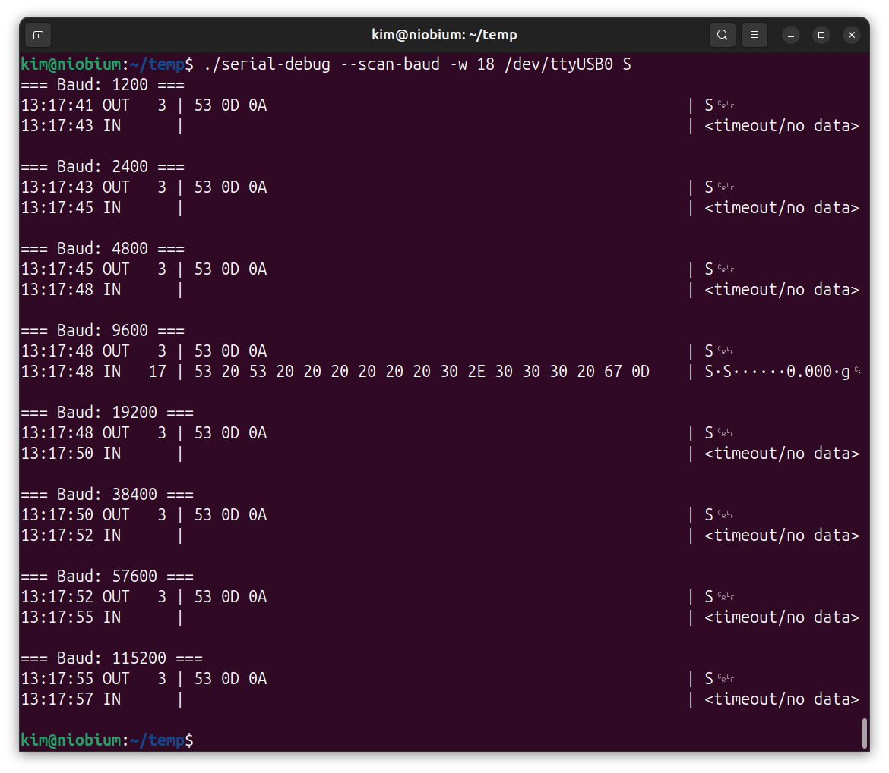
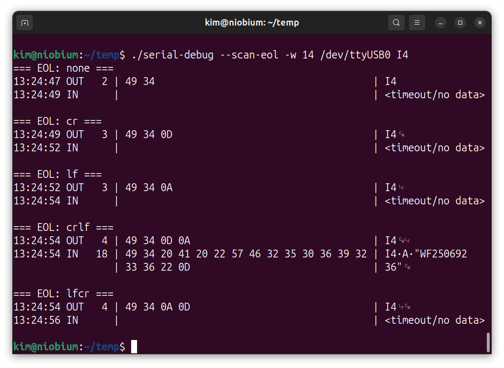

# serial-debug


`serial-debug` is a small Bash tool for debugging serial communication
with laboratory instruments, sensors, and embedded devices. It works as
a **serial protocol debugger**, displaying traffic in **hex and ASCII**
and helping identify the correct **baud rate** and **line endings** when
device communication parameters are unknown.

Many serial terminal programs such as `minicom`, `screen`, or `picocom`
assume that the correct settings are already known. In practice this is
often not the case when working with measurement equipment or industrial
devices. `serial-debug` removes the guesswork by making the underlying
byte-level communication visible and by providing simple tools for
discovering working serial parameters.

Supports **RS-232, RS-485 and UART serial communication** and is
implemented as a **single portable Bash script with no external
dependencies**.

## Features

- hex + ASCII serial traffic display
- automatic baud rate scanning
- automatic EOL (CR/LF) scanning
- interactive command mode
- text decoding of responses
- logging to file
- millisecond and microsecond timestamps
- serial sniff/listen mode
- single Bash script, no dependencies

<p align="center">

</p>

---

## Example: EOL scanning

Many instruments require a specific line ending (`CR`, `LF`, or `CRLF`).
When documentation is unclear, `serial-debug` can test them automatically.

```bash
./serial-debug --scan-eol /dev/ttyUSB0 I4
````



The correct line ending becomes obvious as soon as the device responds.

---

## Example: Baud rate scanning

Another common problem is unknown baud rate.

```bash
./serial-debug --scan-baud /dev/ttyUSB0 S
```

The correct baud rate becomes immediately visible when a response appears.

---

## Quick start

Make the script executable:

```bash
chmod +x serial-debug
```

Basic usage:

```bash
./serial-debug /dev/ttyUSB0 S
```

Interactive mode:

```bash
./serial-debug --interactive /dev/ttyUSB0
```

---

## Usage

```
Usage: serial-debug [OPTIONS] DEVICE COMMAND

General:
  --baud B           set baud rate
  --eol MODE         set line ending (none, cr, lf, crlf, lfcr)
  -w N               wait time for response

Modes:
  --scan-eol         scan common EOL variants
  --scan-baud        scan common baud rates
  --interactive      interactive command mode
  --listen           listen/sniff mode

Output:
  --text             show decoded text line
  --ts-ms            timestamps in milliseconds
  --ts-us            timestamps in microseconds

Logging:
  --log FILE         write output to log file
  --append           append to log file

Other:
  --help             show help
  --version          show version
```

---

## Examples

Additional usage examples can be found in:

```
examples/usage-examples.txt
examples/dps-dump.txt
```

---

## Why this tool exists

Many laboratory instruments and industrial devices still use serial
communication, but debugging them can be unnecessarily difficult.

Common serial terminal programs such as `minicom`, `screen`, or
`picocom` assume that the correct communication parameters are already
known.

In practice this is often not the case.

`serial-debug` helps identify:

* correct baud rate
* correct line ending
* actual byte-level communication

quickly and reliably.

---

## Tested with

* laboratory scales
* RS-485 sensors
* embedded devices
* USB serial adapters

---

## Platform

Linux (tested)

The tool relies on standard Linux serial device interfaces such as:

/dev/ttyUSB*<br>
/dev/ttyACM*

Other Unix-like systems (e.g. macOS) may work but are currently untested.

---

## License

This project is licensed under the MIT License.

Copyright (c) 2026 Kim Miikki

